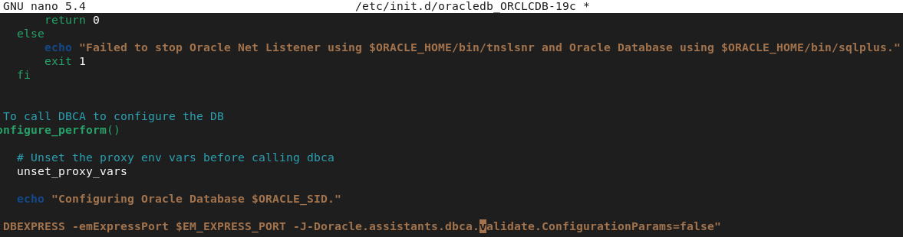
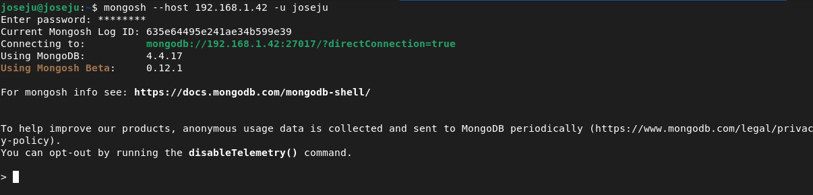

# Alumno 2

---

## Oracle 19c 

### Instalación

Lo primero que debemos hacer es descargarnos desde la página oficial de oracle el paquete .rpm y subirlo por scp a nuestro servidor, y una vez hecho eso, haremos lo siguiente:

- Instalamos alien y paquetes necesarios:

```bash
apt install alien libaio1 unixodbc
```

- Ahora con alien, reconvertimos el fichero .rpm a dpkg, esto tardará un buen rato, depende del rendimiento que tengas en el sistema:

```bash
alien --scripts -d oracle-database-ee-19c-1.0-1.x86_64.rpm
```

- Una vez ha terminado la reconversión, dentro del fichero /sbin/chkconfig, añadimos lo siguiente:

```bash
#!/bin/bash
# Oracle 19c installer chkconfig hack
file=/etc/init.d/oracle-19c
if [[ ! `tail -n1 $file | grep INIT` ]]; then
echo >> $file
echo '### BEGIN INIT INFO' >> $file
echo '# Provides: Oracle 19c' >> $file
echo '# Required-Start: $remote_fs $syslog' >> $file
echo '# Required-Stop: $remote_fs $syslog' >> $file
echo '# Default-Start: 2 3 4 5' >> $file
echo '# Default-Stop: 0 1 6' >> $file
echo '# Short-Description: Oracle 19c' >> $file
echo '### END INIT INFO' >> $file
fi
update-rc.d oracle-19c defaults 80 01
```

- Ahora le damos permisos al fichero:

```bash
chmod 777 /sbin/chkconfig 
```

- Añadimos lo siguiente al fichero /etc/sysctl.d/60-oracle.conf para configurar los parámetros del kernel:

```bash
# Oracle 19c kernel parameters
fs.file-max=6815744
net.ipv4.ip_local_port_range=9000 65000
kernel.sem=250 32000 100 128
kernel.shmmax=536870912
```

- Arrancamos el servicio procps:

```bash
systemctl start procps
```

- Añadimos el siguiente contenido al fichero /etc/rc2.d/S01shm_load: 

```bash
#!/bin/sh
case "$1" in
start) mkdir /var/lock/subsys 2>/dev/null
       touch /var/lock/subsys/listener
       rm /dev/shm 2>/dev/null
       mkdir /dev/shm 2>/dev/null
       mount -t tmpfs shmfs -o size=2048m /dev/shm ;;
*) echo error
   exit 1 ;;
esac
```

- Le damos permisos:

```bash
chmod 777 /etc/rc2.d/S01shm_load
```

- Reiniciamos el sistema:

```bash
reboot
```

- Instalamos el paquete .deb que reconvertimos anteriormente:

```bash
dpkg --install oracle-database-ee-19c_1.0-2_amd64.deb
```

- Una vez instalado, añadimos el parámetro -J-Doracle.assistants.dbca.validate.ConfigurationParams=false dentro de /etc/init.d/oracledb_ORCLCDB-19c:



- Ahora, ejecutamos el siguiente comando para configurar oracle:

```bash
root@escenario:~# /etc/init.d/oracledb_ORCLCDB-19c configure
```


- Dentro de bashrc añado las siguientes variables de entorno:

```bash
# Oracle environment variables
export ORACLE_HOME=/opt/oracle/product/19c/dbhome_1
export ORACLE_SID=ORCLCDB
export NLS_LANG=`$ORACLE_HOME/bin/nls_lang.sh`
export ORACLE_BASE=/opt/oracle
export LD_LIBRARY_PATH=$ORACLE_HOME/lib:$LD_LIBRARY_PATH
export PATH=$ORACLE_HOME/bin:$PATH
```

- Reinciamos la máquina:

```bash
reboot
```

- Iniciamos el servicio de oracle:

```bash
sudo systemctl start oracledb_ORCLCDB-19c
```

- Finalmente accedemos a oracle:

```sql
oracle@oracle:~$ sqlplus / as sysdba

SQL*Plus: Release 19.0.0.0.0 - Production on Sun Oct 30 19:26:55 2022
Version 19.3.0.0.0

Copyright (c) 1982, 2019, Oracle.  All rights reserved.


Conectado a:
Oracle Database 19c Enterprise Edition Release 19.0.0.0.0 - Production
Version 19.3.0.0.0

SQL> 
```

### Creación de usuarios

Para crear un usuario hacemos lo siguiente:

- Creamos el usuario con contraseña y le damos permisos:

```sql
SQL> create user joseju identified by lolazo25;

Usuario creado.

SQL> grant all privileges to joseju;

Concesion terminada correctamente.
```

- Accedemos a oracle con el usuario que hemos creado para comprobar que todo funciona correctamente:

```sql
oracle@oracle:~$ sqlplus joseju

SQL*Plus: Release 19.0.0.0.0 - Production on Sun Oct 30 19:32:38 2022
Version 19.3.0.0.0

Copyright (c) 1982, 2019, Oracle.  All rights reserved.

Enter password: 

Conectado a:
Oracle Database 19c Enterprise Edition Release 19.0.0.0.0 - Production
Version 19.3.0.0.0

SQL> 
```

### Creación Base de datos

Creamos las siguientes tablas:

```sql
SQL> CREATE TABLE usuarios (
  id NUMBER(3) NOT NULL,
  nombre VARCHAR2(20) NOT NULL,
  password char(102) NOT NULL,
  fullname VARCHAR2(50),
  CONSTRAINT usuarios_pk PRIMARY KEY (id)
);

Tabla creada.

SQL> CREATE TABLE autores (
  id NUMBER(3) NOT NULL,
  nombre VARCHAR2(20) NOT NULL,
  apellidos VARCHAR2(50) NOT NULL,
  CONSTRAINT autor_pk PRIMARY KEY (id)
);  

Tabla creada.

SQL> CREATE TABLE libros (
  id NUMBER(3) NOT NULL,
  id_autor NUMBER(3) NOT NULL,
  nombre VARCHAR2(20) NOT NULL,
  CONSTRAINT libros_pk PRIMARY KEY (id),
  CONSTRAINT id_autor_fk FOREIGN KEY (id_autor)
    REFERENCES autores (id)
);

Tabla creada.

SQL> CREATE TABLE compralibro (
  id_usuario NUMBER(3) NOT NULL,
  id_libro NUMBER(3) NOT NULL,
  CONSTRAINT libro_usuario_pk PRIMARY KEY (id_usuario,id_libro),
  CONSTRAINT id_usuario_fk FOREIGN KEY (id_usuario)
    REFERENCES usuarios (id),
  CONSTRAINT id_libro_fk FOREIGN KEY (id_libro)
    REFERENCES libros (id)
);

Tabla creada.
```

Mostramos las tablas que acabamos de crear:

```sql
SQL> select table_name from user_tables order by table_name;

TABLE_NAME
--------------------------------------------------------------------------------
AUTORES
COMPRALIBRO
LIBROS
USUARIOS

```

### Configuracion Acceso remoto

Para configurar el acceso remoto haremos lo siguiente:

- Modifico el fichero de configuración /opt/oracle/product/19c/dbhome_1/network/admin/listener.ora y lo dejamos asi:


- Iniciamos lsnrctl:

```sql
oracle@oracle:~$ lsnrctl start

LSNRCTL for Linux: Version 19.0.0.0.0 - Production on 30-OCT-2022 19:49:06

Copyright (c) 1991, 2019, Oracle.  All rights reserved.

TNS-01106: Listener using listener name LISTENER has already been started
```

Reiniciamos el servicio y en el apartado de prueba conexion servidor oracle comprobamos que funciona.

---

## MariaDB

### Instalación

- Primero actualizamos el sistema:

```bash
sudo apt update -y && sudo apt upgrade -y
```

- Instalamos el paquete mariadb-server:

```bash
sudo apt install -y mariadb-server
```

- Comprobamos el estado del servicio postgres para comprobar que funciona:


### Creación de usuarios

- Crearemos el usuario joseju:

```sql
MariaDB [(none)]> CREATE USER 'joseju'@'localhost' IDENTIFIED BY 'lolazo25';
Query OK, 0 rows affected (0.006 sec)
```

### Creación Base de datos

Ahora que hemos creado el usuario, procederemos a crear la base de datos. Haremos lo siguiente:

- Creamos la base de datos:

```sql
MariaDB [(none)]> create database flask_login;
Query OK, 1 row affected (0.000 sec)
```

- Le damos los privilegios al usuario que creamos anteriormente:

```sql
MariaDB [(none)]> GRANT ALL ON flask_login.* TO 'joseju'@'localhost';
Query OK, 0 rows affected (0.006 sec)

MariaDB [(none)]> FLUSH PRIVILEGES;
Query OK, 0 rows affected (0.001 sec)
```
- Accedemos a la base de datos a través de nuestro usuario:

```bash
root@escenario:~# mysql -u joseju -p
Enter password: 
Welcome to the MariaDB monitor.  Commands end with ; or \g.
Your MariaDB connection id is 31
Server version: 10.5.15-MariaDB-0+deb11u1 Debian 11

Copyright (c) 2000, 2018, Oracle, MariaDB Corporation Ab and others.

Type 'help;' or '\h' for help. Type '\c' to clear the current input statement.

MariaDB [(none)]> use flask_login;
Database changed
MariaDB [flask_login]> 
```

- Creamos las siguientes tablas:

```sql
MariaDB [flask_login]> CREATE TABLE `user` (
    ->   `id` smallint(3) UNSIGNED NOT NULL,
    ->   `username` varchar(20) COLLATE utf8_unicode_ci NOT NULL,
    ->   `password` char(102) COLLATE utf8_unicode_ci NOT NULL,
    ->   `fullname` varchar(50) COLLATE utf8_unicode_ci NOT NULL,
    ->   CONSTRAINT pk_id PRIMARY KEY (id)
    -> ) ENGINE=InnoDB DEFAULT CHARSET=utf8 COLLATE=utf8_unicode_ci COMMENT='Stores the user''s data.';
Query OK, 0 rows affected, 1 warning (0.041 sec)

MariaDB [flask_login]> CREATE TABLE `autor` (
    ->   `id` smallint(3) UNSIGNED NOT NULL,
    ->   `nombre` varchar(20) COLLATE utf8_unicode_ci NOT NULL,
    ->   `apellidos` varchar(20) COLLATE utf8_unicode_ci NOT NULL,
    ->   CONSTRAINT pk_id_autor PRIMARY KEY (id)
    -> ) ENGINE=InnoDB DEFAULT CHARSET=utf8 COLLATE=utf8_unicode_ci COMMENT='Stores the author''s data.';
Query OK, 0 rows affected, 1 warning (0.040 sec)

MariaDB [flask_login]> CREATE TABLE `libro` (
    ->   `id` smallint(3) UNSIGNED NOT NULL,
    ->   `idautor` smallint(3) UNSIGNED NOT NULL,
    ->   `nombre` varchar(20) COLLATE utf8_unicode_ci NOT NULL,
    ->   CONSTRAINT pk_id_libro PRIMARY KEY (id),
    ->   FOREIGN KEY (idautor) REFERENCES autor(id)
    -> ) ENGINE=InnoDB DEFAULT CHARSET=utf8 COLLATE=utf8_unicode_ci COMMENT='Stores the book''s data.';
Query OK, 0 rows affected, 1 warning (0.049 sec)

MariaDB [flask_login]> CREATE TABLE `compralibro` (
    ->   `idcliente` smallint(3) UNSIGNED NOT NULL,
    ->   `idlibro` smallint(3) UNSIGNED NOT NULL,
    ->   CONSTRAINT pk_ids PRIMARY KEY (idcliente,idlibro),
    ->   FOREIGN KEY (idcliente) REFERENCES user(id),
    ->   FOREIGN KEY (idlibro) REFERENCES libro(id)
    -> ) ENGINE=InnoDB DEFAULT CHARSET=utf8 COLLATE=utf8_unicode_ci COMMENT='Regitra la compras de los libros.';
Query OK, 0 rows affected, 1 warning (0.062 sec)
```
- Mostramos las tablas que acabamos de crear:

```sql
MariaDB [flask_login]> show tables;
+-----------------------+
| Tables_in_flask_login |
+-----------------------+
| autor                 |
| compralibro           |
| libro                 |
| user                  |
+-----------------------+
4 rows in set (0.001 sec)
```

### Configuracion Acceso remoto

En este apartado configuraremos el acceso remoto al servidor mariadb, para ello haremos lo siguiente:

- Dentro del fichero /etc/mysql/mariadb.conf.d/50-server.cnf modifico la siguiente línea:


Reiniciamos el servicio y en el apartado de prueba conexion servidor mariadb comprobamos que funciona.

---

## Postgres

### Instalación

- Primero actualizamos el sistema:

```bash
sudo apt update -y && sudo apt upgrade -y
```

- Instalamos el paquete postgresql-13:

```bash
sudo apt install -y postgresql-13
```

- Comprobamos el estado del servicio postgres para comprobar que funciona:


### Creación de usuarios

- Con el siguiente comando creamos al usuario joseju como un superusuario:

```bash
sudo -u postgres createuser joseju --interactive -P
```


Una vez hemos creado el usuario, habilitaremos el uso de contraseña para poder acceder a mongo con autenticación:

- Para activar el uso de contraseña, cambiamos dentro del fichero de configuración pg_hba.conf la siguiente directiva y cambiamos la palabra peer por md5:


- Una vez modificado, reiniciamos el servicio:

```bash
systemctl reload postgresql
```

- Iniciamos postgres para ver si nos pide la contraseña:


### Creación Base de datos

- Ahora creamos una base de datos llamada libreria:


- Cambiamos a la base de datos recien creada:

```sql
joseju=# \c libreria
You are now connected to database "libreria" as user "joseju".
```

- A continuación crearemos las tablas de esta base de datos:

```sql
libreria=# CREATE TABLE usuarios (
   ID SERIAL PRIMARY KEY,
   NOMBRE varchar(20),
   PASSWORD char(102),
   FULLNAME varchar(50)
);
CREATE TABLE

libreria=# CREATE TABLE autor (
   id SERIAL PRIMARY KEY,
   nombre varchar(20),
   apellidos varchar(20)
);
CREATE TABLE

libreria=# CREATE TABLE libros (
   id SERIAL PRIMARY KEY,
   idautor SERIAL,
   nombre varchar(20),
   constraint FK_autor foreign key (idautor) references autor(id)
);
CREATE TABLE

libreria=# CREATE TABLE compralibro (
   idcliente SERIAL,
   idlibro SERIAL,
   primary key(idcliente,idlibro),
   constraint FK_cliente foreign key (idcliente) references usuarios(id),
   constraint FK_libro foreign key (idlibro) references libros(id)
);
CREATE TABLE
```

- Mostramos las tablas que acabamos de crear:

```sql
libreria=# \dt
           List of relations
 Schema |    Name     | Type  | Owner  
--------+-------------+-------+--------
 public | autor       | table | joseju
 public | compralibro | table | joseju
 public | libros      | table | joseju
 public | usuarios    | table | joseju
(4 rows)
```

### Configuración Acceso remoto

Para configurar el acceso remoto, debemos modificar dos ficheros, postgresql.conf y pg_hba.conf y modificar las siguientes líneas:

- En el fichero postgresql.conf indicamos la dirección IP de nuestro servidor:


- En el fichero ph_hba.conf_ habilitaremos el uso de contraseña:


Reiniciamos el servicio y en el apartado de prueba conexion servidor postgres comprobamos que funciona.

---

## MongoDB

### Instalación

- En primer lugar instalamos las dependencias necesarias:

```bash
apt-get install curl apt-transport-https software-properties-common gnupg2 -y
```

- Seguidamente, añadimos la clave GPG y también añadimos el repositorio de mongodb:

```bash
wget -qO - https://www.mongodb.org/static/pgp/server-4.4.asc | apt-key add -
```

```bash
echo "deb http://repo.mongodb.org/apt/debian buster/mongodb-org/4.4 main" | tee /etc/apt/sources.list.d/mongodb-org.list
```

- A continuación, actualizamos el sistema e instalamos el paquete mongodb-org:

```bash
sudo apt update -y && sudo apt install mongodb-org -y
```

- Ahora, iniciamos el servicio de mongo:

```bash
sudo systemctl start mongod && sudo systemctl enable mongod
```

- Finalmente verificamos la version de mongo que hemos instalado:

```bash
mongod --version
```


### Creación de usuarios

Por defecto, la autenticación en mongodb no esta habilitada, así que por razones de seguridad, habilitaremos la autentiación. Para ello haremos lo siguiente:

- Primero iniciamos la shell de mongo:

```bash
mongo
```

- Seguidamente modificamos una base de datos llamada admin:

```sql
use admin
```

- Ahora, creamos nuestro usuario e introducimos una contraseña:

```json
db.createUser(
{
user: "joseju",
pwd: "lolazo25",
roles: [ { role: "root", db: "admin" } ]
}
)
```


- A continuación, pulsamos ctrl+D para salir de mongo, y editamos el archivo de configuración /etc/mongo.conf añadiendo las siguientes líneas para activar la autenticación:


- Reiniciamos mongo e intentamos acceder para ver si no pide las credenciales:


### Creación Base de datos

Procederemos a crear una base de datos llamada libreria con tres colecciones y con información variada, las colecciones que crearemos serán:

- usuario

- libro

- autor

Dentro de la colección usuario, almacenaremos los datos del usuario, su contraseña para acceder al sistema, su nombre y su id.

Dentro de la colección libros, almacenaremos los datos de los libros, el nombre del libro, el autor que escribio el libro y su id.

Dentro de la colección autores, almacenaremos los datos de los autores, el nombre y apellidos del autor y su id.

En mongo, las bases de datos que se crean son de tipo no relacionales, es decir, no se crean mediante tablas, claves... Sino mediante json.

Lo primero que haremos para crear las colecciones:

```bash
> use libreria;
switched to db libreria
> db.createCollection("usuarios")
{ ok: 1 }
> db.createCollection("libros")
{ ok: 1 }
> db.createCollection("autores")
{ ok: 1 }
```

Comprobamos que hemos creado los documentos:

```bash
> show collections
usuarios
libros
autores
```

Insertamos los siguientes documentos:

```json
db.usuarios.insertMany( [
{id: 1, 
usuario: "joseju", 
password: "pbkdf2:sha256:260000$FHhIsLue8dRwFAIM$ef37e5b262fb3d687112e232cd47abf1ec83f4c653b7bcbf95fa3993298fb5df", 
fullname: "Jose Juan"} 
] )

db.libros.insertMany( [
{ id: 100,
nombre: "El Quijote",
autor: "Cervantes"}
] )

db.autores.insertMany( [
{id: 1000,
autname: "Cervantes",
nombre: "Miguel",
apellidos: "Cervantes Saavedra"}
] )
```

Compruebo que se ha añadido todo correctamente:

```bash
> db.usuarios.find()
[
  {
    _id: ObjectId("635e7fe5024ab00ff3a1377c"),
    id: 1,
    usuario: 'joseju',
    password: 'pbkdf2:sha256:260000$FHhIsLue8dRwFAIM$ef37e5b262fb3d687112e232cd47abf1ec83f4c653b7bcbf95fa3993298fb5df',
    fullname: 'Jose Juan'
  }
]
> db.libros.find()
[
  {
    _id: ObjectId("635e838d024ab00ff3a1377d"),
    id: 100,
    nombre: 'El Quijote',
    autor: 'Cervantes'
  }
]
> db.autores.find()
[
  {
    _id: ObjectId("635e8399024ab00ff3a1377e"),
    id: 1000,
    autname: 'Cervantes',
    nombre: 'Miguel',
    apellidos: 'Cervantes Saavedra'
  }
]
```

### Configuración Acceso remoto

Para la configuración del acceso remoto haremos lo siguiente:

- Modificaremos el fichero de configuración /etc/mongod.conf y en el parámetro e bindIp dentro del apartado net, establecemo el valor 0.0.0.0:


Reiniciamos el servicio de mongo y comprobamos que funciona en el apartado de cliente remoto mongodb. 

---

## Prueba Cliente Remoto MongoDB

- Dentro del cliente, añadimos la clave gpg y repositorio de mongo, actualizamos los repositorios e instalamos el cliente remoto de mongodb, que en nuestro caso se llama mongosh:

```bash
wget -qO - https://www.mongodb.org/static/pgp/server-4.4.asc | apt-key add -
```

```bash
echo "deb http://repo.mongodb.org/apt/debian buster/mongodb-org/4.4 main" | tee /etc/apt/sources.list.d/mongodb-org.list
```

```bash
sudo apt update && sudo apt install mongosh
```

- Una vez hemos instalado el cliente de mongo, ejecutamos el siguiente comando para conectarnos al servidor de mongo:

```bash
mongosh --host 192.168.1.42 -u joseju
```



---

## Realización de Aplicacion Web

Realizaremos una aplicación web escrita en python donde accederemos a la página a través de un usuario y una contraseña almacenados en la base de datos que creamos anteriormente en mysql. Para ello vamos a hacer lo siguiente.

- Primero, creamos un entorno virtual donde realizaremos nuestra aplicación web:

```bash
python3 -m venv mysql
```

- Luego instalamos todos los paquetes necesarios para que la aplicación funcione:

```bash
pip install flask flask-login flask-mysqldb flask-WTF
```

- Después, de haber instalado los paquetes, escribimos el código que dejare en este repsoritorio de git:

https://github.com/joseju10/app-bbdd

- Iniciamos el servicio mediante el siguiente comando:

```bash
python3 app.py
```

- Accedemos a la página e iniciamos sesión con el usuario y la contraseña que añadimos en la base de datos mariadb:


